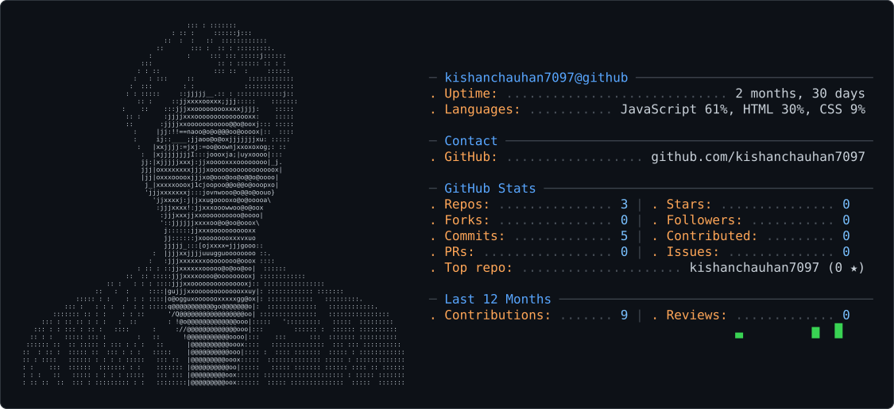

<picture>
  <source media="(prefers-color-scheme: dark)" srcset="dark_mode.svg" />
  <source media="(prefers-color-scheme: light)" srcset="light_mode.svg" />
  
</picture>

[Kishan's GitHub Stats](https://github-readme-stats.vercel.app/api?username=kishanchauhan7097&show_icons=true&theme=radium)

[Top Languages](https://github-readme-stats.vercel.app/api/top-langs/?username=kishanchauhan7097&layout=compact&theme=dracula)

